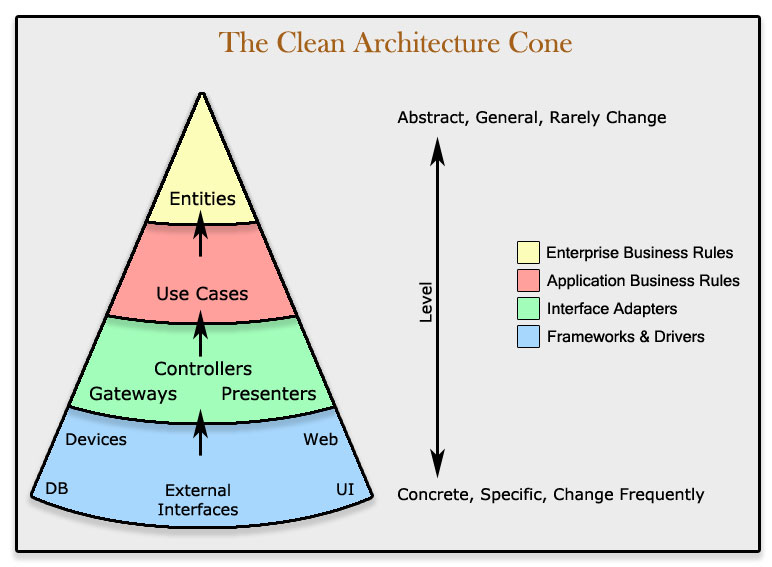

## About the Project
This project is a simple way to show some coding skills and software architecture. All the backend code are 100% tested with unit and integration tests.

## Software Architecture Decisions
All the project-related files are inside the `src` directory, where you'll find the four layers where this application is distributed.

I've tried to follow something like the image above, where we have the most internal layers isolated, and those layers do not know about the external ones. Working that way, we encapsulate all the business core from any external library/framework, making it possible to change tools like Laravel to Symphony without suffering a lot to do this change, for example.

## Stack
- [PHP 8.1](https://www.php.net/releases/8.1/en.php);
- [Laravel](https://laravel.com);
- [PHPUnit](https://phpunit.de/);
- [MySQL](https://mysql.com);
- [Docker](https://docker.com);
- [VueJs](https://vuejs.org);
- [Bootstrap](https://getbootstrap.com);
- [Heroku](https://heroku.com);

## Thanks
